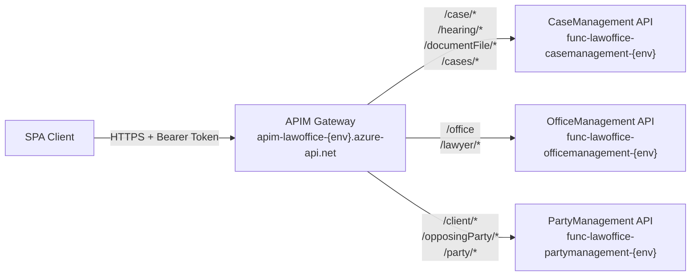
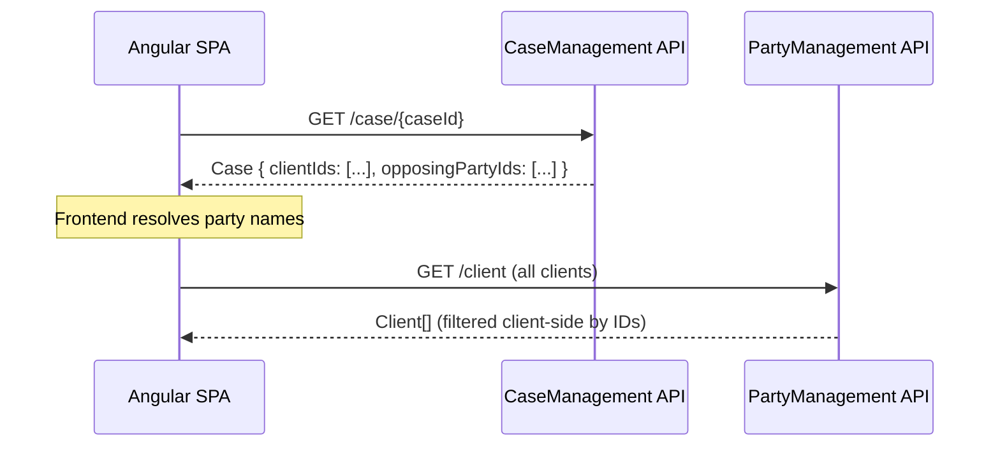

# API Design

## Document Information

| Item               | Detail                                         |
|--------------------|-------------------------------------------------|
| **Project**        | LawOffice - B2C SaaS for Small Law Offices      |
| **Version**        | 1.0                                              |
| **Last Updated**   | 2026-03-10                                       |

---

## 1. API Architecture Overview

The LawOffice platform exposes its functionality through three independent RESTful APIs, each implemented as an Azure Functions project and unified behind a single Azure API Management (APIM) gateway. The APIM gateway provides a single entry point for all API consumers.

### 1.1 API Gateway Pattern



### 1.2 API Design Conventions

| Convention              | Rule                                                           |
|-------------------------|----------------------------------------------------------------|
| **Protocol**            | HTTPS only                                                     |
| **Format**              | JSON (request/response bodies)                                 |
| **Versioning**          | Not currently versioned (APIM `apiRevision: 1`)               |
| **Authentication**      | Bearer JWT token in `Authorization` header                     |
| **Tenant Context**      | `X-Office-Id` header (injected by APIM from JWT claim)         |
| **HTTP Methods**        | GET (read), POST (create), PUT (full update), DELETE (remove) |
| **Path Style**          | camelCase resource names                                       |
| **ID Parameters**       | Path parameters for GET-by-ID and DELETE                       |
| **Error Responses**     | Standard HTTP status codes (400, 401, 404, etc.)              |

---

## 2. API Catalog

### 2.1 CaseManagement API (APIM path: `/case`)

#### Case Operations

| Method | Path                        | Operation ID          | Description                       |
|--------|-----------------------------|-----------------------|-----------------------------------|
| GET    | `/case/{caseId}`            | get-getcase           | Get a single case by ID           |
| GET    | `/case`                     | get-getallcases       | Get all cases for the office      |
| POST   | `/case`                     | post-postcase         | Create a new case                 |
| PUT    | `/case`                     | put-putcase           | Update an existing case           |
| DELETE | `/case/{caseId}`            | delete-deletecase     | Delete a case                     |
| GET    | `/cases/count`              | get-getcount          | Get active + total case counts    |
| GET    | `/cases/last/{count}`       | get-getlastcases      | Get last N active cases           |
| GET    | `/cases/hearings/{count}`   | get-getcaseswithhearings | Get cases with upcoming hearings |

#### Hearing Operations

| Method | Path                        | Operation ID          | Description                       |
|--------|-----------------------------|-----------------------|-----------------------------------|
| GET    | `/hearing/{hearingId}`      | get-gethearing        | Get a single hearing by ID        |
| GET    | `/hearing/case/{caseId}`    | get-getallhearings    | Get all hearings for a case       |
| POST   | `/hearing`                  | post-posthearing      | Create a new hearing              |
| PUT    | `/hearing`                  | put-puthearing        | Update an existing hearing        |
| DELETE | `/hearing/{hearingId}`      | delete-deletehearing  | Delete a hearing                  |

#### DocumentFile Operations

| Method | Path                            | Operation ID              | Description                       |
|--------|---------------------------------|---------------------------|-----------------------------------|
| GET    | `/documentFile/{documentFileId}` | get-getdocumentfile      | Get document metadata (+SAS URIs) |
| GET    | `/documentFile/case/{caseId}`   | get-getalldocumentfiles  | Get all documents for a case      |
| POST   | `/documentFile`                 | post-postdocumentfile    | Create document metadata (+SAS URI)|
| PUT    | `/documentFile`                 | put-putdocumentfile      | Update document metadata          |
| DELETE | `/documentFile/{documentFileId}` | delete-deletedocumentfile| Delete document metadata + blob  |

### 2.2 OfficeManagement API (APIM path: `/office`)

#### Office Operations

| Method | Path                        | Operation ID          | Description                       |
|--------|-----------------------------|-----------------------|-----------------------------------|
| GET    | `/office`                   | get-getoffice         | Get the office for current tenant |
| PUT    | `/office`                   | put-putoffice         | Update office details             |

#### Lawyer Operations

| Method | Path                        | Operation ID          | Description                       |
|--------|-----------------------------|-----------------------|-----------------------------------|
| GET    | `/lawyer/{lawyerId}`        | get-getlawyer         | Get a single lawyer by ID         |
| GET    | `/lawyer`                   | get-getalllawyers     | Get all lawyers for the office    |
| POST   | `/lawyer`                   | post-postlawyer       | Create a new lawyer profile       |
| PUT    | `/lawyer`                   | put-putlawyer         | Update a lawyer profile           |

### 2.3 PartyManagement API (APIM path: `/party`)

#### Client Operations

| Method | Path                        | Operation ID          | Description                       |
|--------|-----------------------------|-----------------------|-----------------------------------|
| GET    | `/client/{clientId}`        | get-getclient         | Get a single client by ID         |
| GET    | `/client`                   | get-getallclients     | Get all clients for the office    |
| POST   | `/client`                   | post-postclient       | Create a new client               |
| PUT    | `/client`                   | put-putclient         | Update a client                   |

#### Opposing Party Operations

| Method | Path                              | Operation ID               | Description                       |
|--------|-----------------------------------|----------------------------|-----------------------------------|
| GET    | `/opposingParty/{opposingPartyId}` | get-getopposingparty      | Get a single opposing party by ID |
| GET    | `/opposingParty`                  | get-getallopposingparties  | Get all opposing parties          |
| POST   | `/opposingParty`                  | post-postopposingparty     | Create a new opposing party       |
| PUT    | `/opposingParty`                  | put-putopposingparty       | Update an opposing party          |

#### Party Aggregate Operations

| Method | Path                        | Operation ID          | Description                       |
|--------|-----------------------------|-----------------------|-----------------------------------|
| GET    | `/party/count`              | get-getcount          | Get combined client + opposing party counts |

---

## 3. Request/Response Format

### 3.1 Common Headers

**Request Headers (all endpoints):**

| Header            | Required | Source        | Description                        |
|-------------------|----------|---------------|------------------------------------|
| `Authorization`   | Yes      | Client (MSAL) | `Bearer {access_token}`           |
| `Content-Type`    | Yes*     | Client        | `application/json` (POST/PUT)     |
| `X-Office-Id`     | Yes      | APIM (injected) | Tenant identifier from JWT claim |

*Required for POST and PUT requests.

### 3.2 Response Status Codes

| Status Code | Meaning                    | Used When                              |
|-------------|----------------------------|----------------------------------------|
| 200         | OK                         | Successful GET, PUT                    |
| 201         | Created                    | Successful POST (resource created)     |
| 204         | No Content                 | Successful DELETE                      |
| 400         | Bad Request                | Missing X-Office-Id, invalid body, validation failure |
| 401         | Unauthorized               | Missing or invalid JWT (APIM level)    |
| 404         | Not Found                  | Resource not found by ID               |

### 3.3 Entity Models

#### Case

```json
{
  "id": "guid",
  "officeId": "guid",
  "clientIds": ["guid", "guid"],
  "opposingPartyIds": ["guid"],
  "identificationNumber": "string (required)",
  "description": "string (optional)",
  "active": true,
  "competentCourt": "string (optional)",
  "city": "string (optional)",
  "year": "string (optional)",
  "judge": "string (optional)"
}
```

#### Hearing

```json
{
  "id": "guid",
  "officeId": "guid",
  "caseId": "guid (required)",
  "courtroom": "string (required)",
  "description": "string (optional)",
  "date": "datetime",
  "held": false
}
```

#### DocumentFile

```json
{
  "id": "guid",
  "officeId": "guid",
  "caseId": "guid (required)",
  "name": "string (required)"
}
```

#### Office

```json
{
  "id": "guid",
  "name": "string (required)",
  "address": "string (optional)"
}
```

#### Lawyer

```json
{
  "id": "guid",
  "officeId": "guid",
  "firstName": "string (required)",
  "lastName": "string (required)",
  "email": "string (validated email format)",
  "invitationCode": "string",
  "active": true
}
```

#### Party (Client / OpposingParty)

```json
{
  "id": "guid",
  "officeId": "guid",
  "firstName": "string (required)",
  "lastName": "string (required)",
  "address": "string (optional)",
  "description": "string (optional)",
  "phone": "string (optional)",
  "identificationNumber": "string (optional)"
}
```

#### CaseCount (response only)

```json
{
  "totalCount": 0,
  "activeCount": 0
}
```

#### PartyCount (response only)

```json
{
  "clientCount": 0,
  "opposingPartyCount": 0
}
```

---

## 4. API Gateway Configuration

### 4.1 APIM API Structure

Each microservice is registered as a separate APIM API with its own base path:

| APIM API Name    | Base Path  | Backend                                     | Subscription Required |
|------------------|------------|----------------------------------------------|-----------------------|
| CaseManagement   | `/case`    | `func-lawoffice-casemanagement-{env}`       | No                    |
| OfficeManagement | `/office`  | `func-lawoffice-officemanagement-{env}`     | No                    |
| PartyManagement  | `/party`   | `func-lawoffice-partymanagement-{env}`      | No                    |

### 4.2 APIM Policy Chain

```
┌─────────────────────────────────────┐
│        Global (All Products)         │
│  1. CORS policy                      │
│  2. JWT validation (optional)        │
│     → Extract X-Office-Id            │
├─────────────────────────────────────┤
│        API-Level Policy              │
│  1. set-backend-service              │
│     → Route to Function backend      │
├─────────────────────────────────────┤
│        Operation-Level               │
│  (No operation-specific policies)    │
└─────────────────────────────────────┘
```

### 4.3 Backend Authentication

APIM authenticates to Function Apps using **host-level Function keys** passed in the `x-functions-key` header. The keys are stored as APIM named values (secret) and are auto-provisioned from deployed Function Apps via the Bicep template.

---

## 5. Frontend API Integration

### 5.1 Service Architecture

The Angular SPA uses an Angular service per domain concern:

| Service                  | Backend API        | Endpoints Consumed                     |
|--------------------------|--------------------|----------------------------------------|
| `CaseService`            | CaseManagement     | CRUD cases, counts, last cases         |
| `HearingService`         | CaseManagement     | CRUD hearings, upcoming hearings       |
| `DocumentService`        | CaseManagement     | CRUD documents, SAS URI management     |
| `ClientService`           | PartyManagement    | CRUD clients                           |
| `OpposingPartyService`   | PartyManagement    | CRUD opposing parties                  |
| `PartyService`            | PartyManagement    | Party counts aggregate                 |
| `OfficeService`           | OfficeManagement   | Get/update office                      |
| `LawyerService`           | OfficeManagement   | CRUD lawyers                           |

### 5.2 API Base URL Configuration

API endpoints are configured at runtime via `config.js`, not compiled into the application:

```javascript
// public/config.js (per environment)
window.__env = {
  API_BASE_URL: {
    OFFICE_MANAGEMENT: 'https://apim-lawoffice-dev.azure-api.net/office/api',
    PARTY_MANAGEMENT: 'https://apim-lawoffice-dev.azure-api.net/party/api',
    CASE_MANAGEMENT: 'https://apim-lawoffice-dev.azure-api.net/case/api'
  },
  REDIRECT_URL: 'https://green-sea-058b76203.azurestaticapps.net'
};
```

### 5.3 Local Development Interceptor

In local development (without APIM), the `ApimSimulatorInterceptor` replicates APIM's behavior:

- **Trigger**: Requests to `localhost` or `127.0.0.1` only
- **Action**: Extracts `extension_OfficeId` from JWT → adds `X-Office-Id` header
- **Purpose**: Simulates the claim-to-header extraction that APIM performs in production

---

## 6. Cross-Service Data Composition

### 6.1 Frontend Orchestration Pattern

The frontend performs cross-service data joins. No direct service-to-service calls exist:



### 6.2 Aggregation Endpoints

To minimize round-trips, some specialized aggregation endpoints exist:

| Endpoint                      | Service          | Purpose                                    |
|-------------------------------|------------------|--------------------------------------------|
| `GET /cases/count`            | CaseManagement   | Returns `{ totalCount, activeCount }`      |
| `GET /cases/last/{count}`     | CaseManagement   | Returns last N active cases                |
| `GET /cases/hearings/{count}` | CaseManagement   | Returns cases with upcoming hearings (joined) |
| `GET /party/count`            | PartyManagement  | Returns `{ clientCount, opposingPartyCount }` |

---

## 7. Error Handling Strategy

### 7.1 API Layer Error Handling

| Scenario                       | HTTP Status | Response Body                          |
|--------------------------------|-------------|----------------------------------------|
| Missing `X-Office-Id` header   | 400         | `"Missing X-Office-Id header."`        |
| Invalid/empty request body     | 400         | `"Request body is empty."`             |
| Domain validation failure      | 400         | Validation error message               |
| Resource not found             | 404         | No body                                |
| JWT validation failure         | 401         | APIM error message                     |
| Successful create              | 201         | Created entity (JSON)                  |
| Successful update/read         | 200         | Entity or collection (JSON)            |
| Successful delete              | 204         | No body                                |
| Unexpected internal error      | 500         | `"An unexpected error occurred."`      |

### 7.2 Domain Validation

Entities validate invariants in their factory methods and setter methods, throwing `ArgumentException` for business rule violations. The API layer catches these and returns HTTP 400.

Unhandled exceptions (i.e., those not caught as `ArgumentException`) are caught by a general `catch (Exception)` handler, which returns HTTP 500 with a fixed message `"An unexpected error occurred."` to avoid leaking internal details. The full exception is logged at the `Error` level.

---

## 8. API Operation Summary

| Microservice       | Total Operations | GET | POST | PUT | DELETE |
|--------------------|------------------|-----|------|-----|--------|
| CaseManagement     | 18               | 10  | 3    | 3   | 3      |
| OfficeManagement   | 6                | 3   | 1    | 2   | 0      |
| PartyManagement    | 9                | 5   | 2    | 2   | 0      |
| **Total**          | **33**           | **18** | **6** | **7** | **3** |
