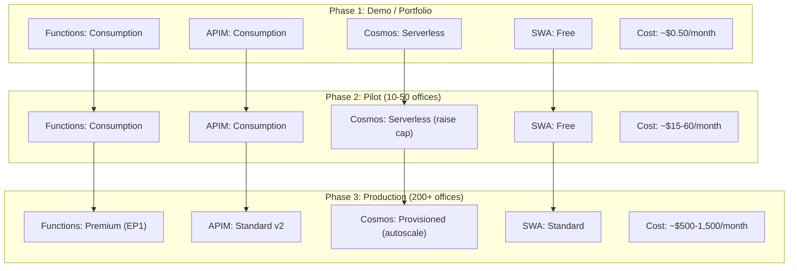

# Cost Analysis & Optimization

## Document Information

| Item               | Detail                                         |
|--------------------|-------------------------------------------------|
| **Project**        | LawOffice - B2C SaaS for Small Law Offices      |
| **Version**        | 1.0                                              |
| **Last Updated**   | 2026-03-10                                       |

---

## 1. Cost Philosophy

The LawOffice platform is designed with a **consumption-first** cost model: every Azure service is selected at the lowest viable tier, incurring near-zero cost when idle. This makes it ideal for a portfolio/demo project while maintaining a clear scaling path to production workloads.

---

## 2. Current Cost Model (Idle / Demo)

### 2.1 Monthly Cost Estimate (Low Traffic)

| Service                       | SKU / Tier        | Estimated Monthly Cost | Notes                          |
|-------------------------------|-------------------|------------------------|--------------------------------|
| Azure Functions (×3)          | Consumption (Y1)  | ~$0.00                 | 1M executions/month free       |
| App Service Plan              | Dynamic (Y1)      | $0.00                  | Included with Functions        |
| API Management                | Consumption       | ~$0.00 – $3.50        | 1M calls/month free; $3.50/1M after |
| Cosmos DB                     | Serverless        | ~$0.25 – $1.00        | Pay per RU + storage ($0.25/GB)|
| Storage Account               | Standard LRS      | ~$0.01 – $0.10        | Minimal blob + table storage   |
| Static Web App                | Free              | $0.00                  | Free tier                      |
| Entra External ID             | Free tier          | $0.00                  | First 50K MAU free             |
| **Total (idle/demo)**         |                   | **~$0.26 – $4.60**    |                                |

### 2.2 Per-Environment Cost

With 3 environments (dev, test, master), each at idle:

| Environment | Monthly Estimate |
|-------------|-----------------|
| dev         | ~$0.26 – $4.60  |
| test        | ~$0.26 – $4.60  |
| master      | ~$0.26 – $4.60  |
| **Total**   | **~$0.78 – $13.80** |

---

## 3. Service-by-Service Cost Analysis

### 3.1 Azure Functions (Consumption)

| Pricing Dimension    | Rate                    | Monthly Free Grant |
|----------------------|-------------------------|--------------------|
| Executions           | $0.20 per million       | 1,000,000          |
| Execution time (GB-s)| $0.000016 per GB-s     | 400,000 GB-s       |

**LawOffice estimate**: With typical demo usage (~1,000 requests/day across 3 services), cost remains within the free grant.

### 3.2 API Management (Consumption)

| Pricing Dimension    | Rate                    | Monthly Free Grant |
|----------------------|-------------------------|--------------------|
| API calls            | $3.50 per million       | 1,000,000          |

**LawOffice estimate**: Demo traffic stays within the free 1M calls/month.

**Note**: Consumption APIM has a ~1-second cold start on the first request after idle periods.

### 3.3 Cosmos DB (Serverless)

| Pricing Dimension    | Rate                    | Notes              |
|----------------------|-------------------------|--------------------|
| Request Units (RUs)  | $0.25 per million RUs   | Pay-per-request    |
| Storage              | $0.25 per GB/month      | Min charge ~$0.01  |
| Throughput cap       | 4,000 RU/s              | Configured limit   |

**LawOffice estimate**: Minimal data volume (< 1 GB) + low query frequency = ~$0.25–$1.00/month.

### 3.4 Azure Storage (Standard LRS)

| Pricing Dimension    | Rate                    | Notes              |
|----------------------|-------------------------|--------------------|
| Blob storage (Hot)   | $0.0184 per GB/month    | Document files     |
| Operations           | $0.0043 per 10K writes  | Minimal            |
| Data transfer (out)  | First 100 GB free       | Within free tier   |

**LawOffice estimate**: < 1 GB storage + minimal operations = ~$0.01–$0.10/month.

### 3.5 Static Web App (Free)

| Pricing Dimension    | Free Tier Limit         |
|----------------------|-------------------------|
| Bandwidth            | 100 GB/month            |
| Storage              | 0.5 GB                  |
| Custom domains       | 2                       |
| Staging environments | 3                       |

**LawOffice estimate**: $0.00 - well within Free tier limits.

### 3.6 Entra External ID

| Pricing Dimension    | Rate                    | Notes              |
|----------------------|-------------------------|--------------------|
| Monthly Active Users | Free up to 50,000 MAU   | Applies to CIAM    |
| Beyond 50K MAU       | $0.0025–$0.015 per auth | Tiered pricing     |

**LawOffice estimate**: $0.00 - demo project with < 10 users.

---

## 4. Scaling Cost Projections

### 4.1 Growth Scenarios

| Scenario               | Monthly Users | API Calls/Month | Cosmos RUs/Month | Est. Cost/Month |
|------------------------|---------------|-----------------|-------------------|-----------------|
| **Demo (current)**     | < 10          | < 10K           | < 100K            | ~$0.50          |
| **Pilot (10 offices)** | 50            | ~500K           | ~5M               | ~$5–$15         |
| **Small-scale (50)**   | 250           | ~2.5M           | ~25M              | ~$25–$60        |
| **Mid-scale (200)**    | 1,000         | ~10M            | ~100M             | ~$100–$250      |
| **Production (1000+)** | 5,000+        | ~50M+           | ~500M+            | ~$500–$1,500+   |

### 4.2 Tier Upgrade Thresholds

| Trigger                                       | Current Tier          | Recommended Upgrade            | Est. Additional Cost  |
|-----------------------------------------------|-----------------------|--------------------------------|-----------------------|
| > 1M API calls/month                          | APIM Consumption      | APIM Standard v2 (or Basic v2) | ~$150–$300/month     |
| > 4,000 RU/s sustained                        | Cosmos Serverless     | Cosmos Provisioned (autoscale) | ~$25+/month (400 RU) |
| Need VNet / private endpoints                 | Functions Consumption | Functions Premium (EP1)        | ~$150+/month         |
| > 0.5 GB SWA storage or custom auth           | SWA Free              | SWA Standard                   | ~$9/month            |
| > 50,000 MAU                                  | Entra Free            | Entra paid tier                | ~$125+/month         |
| Need always-warm APIM                         | APIM Consumption      | APIM Basic v2                  | ~$150/month          |

---

## 5. Cost Optimization Strategies

### 5.1 Current Optimizations (Already Applied)

| Optimization                            | Savings Impact | Implementation                        |
|-----------------------------------------|----------------|---------------------------------------|
| Consumption-tier Functions              | High           | Zero cost at idle                     |
| Serverless Cosmos DB                    | High           | Zero base cost; pay per RU            |
| Free-tier Static Web App               | Medium         | Zero hosting cost                     |
| Shared App Service Plan                 | Medium         | Single plan for 3 Function Apps       |
| Single Cosmos DB account               | Medium         | Shared account, separate databases    |
| Single Storage account                 | Medium         | Shared for runtime + blob storage     |
| Consumption APIM                        | High           | 1M free calls/month                   |
| LRS storage redundancy                 | Low            | Cheapest redundancy option            |
| Cosmos throughput cap (4,000 RU/s)     | High           | Prevents runaway costs                |

### 5.2 Additional Optimization Opportunities

| Optimization                            | Potential Savings | Trade-Off                            |
|-----------------------------------------|-------------------|--------------------------------------|
| Consolidate dev/test environments       | ~50%              | Less isolation between environments  |
| Use Cosmos DB free tier (if eligible)   | ~$10/month        | Only 1 free tier per subscription    |
| Optimize query patterns                 | Variable          | Development effort                   |
| Implement caching (API level)           | 10-30% RU         | Additional complexity                |
| Reduce blob soft-delete retention       | Minimal           | Less recovery window                 |
| Reduce Cosmos backup frequency          | Minimal           | Higher potential data loss            |

---

## 6. Cost Guardrails

### 6.1 Existing Guardrails

| Guardrail                               | Configuration              | Purpose                    |
|-----------------------------------------|----------------------------|----------------------------|
| Cosmos DB throughput cap                | 4,000 RU/s                 | Prevent runaway RU costs   |
| Functions scale limit                   | 200 instances              | Prevent excessive compute  |
| Functions min elastic instances         | 0                          | Scale to zero when idle    |
| SWA Free tier                           | Built-in limits            | No cost overruns possible  |

### 6.2 Recommended Additional Guardrails

| Guardrail                               | Implementation                        |
|-----------------------------------------|---------------------------------------|
| Azure Budget alerts                     | Set per-RG budgets with email alerts  |
| Cost anomaly detection                  | Azure Cost Management anomaly alerts  |
| Resource locks (production)             | Prevent accidental deletion           |
| APIM rate limiting                      | Add rate-limit-by-key policy          |
| Spending cap (subscription)             | Set subscription-level cap            |

---

## 7. Cost Comparison: Current vs. Non-Serverless

To illustrate the value of the serverless-first approach:

| Component         | Current (Serverless)   | Alternative (Traditional)    | Monthly Savings |
|-------------------|------------------------|------------------------------|-----------------|
| Compute           | Functions Consumption ($0) | App Service B1 (×3) (~$40) | ~$40          |
| API Gateway       | APIM Consumption ($0)  | APIM Basic v2 (~$150)       | ~$150           |
| Database          | Cosmos Serverless ($0.50) | Cosmos Provisioned (~$25)  | ~$24            |
| Frontend          | SWA Free ($0)          | App Service B1 (~$13)       | ~$13            |
| **Total**         | **~$0.50**             | **~$228**                    | **~$227/month** |

The serverless approach achieves **>99% cost reduction** at demo/portfolio traffic levels.

---

## 8. Cost Monitoring

### 8.1 Azure Cost Management Setup

```
Azure Portal → Cost Management + Billing → Cost Management:
1. Create budgets per resource group (e.g., $10/month for dev)
2. Set alert thresholds at 50%, 80%, 100%
3. Enable email notifications
4. Review cost analysis weekly during active development
```

### 8.2 Key Cost Dashboards

| Dashboard                         | What to Monitor                              |
|-----------------------------------|----------------------------------------------|
| Cost by resource                  | Identify which service costs most            |
| Cost by meter                     | RU consumption vs. storage vs. compute       |
| Daily cost trend                  | Spot unexpected spikes                       |
| Forecast                          | Project end-of-month cost                    |

---

## 9. Scaling Path Summary



Each phase is an incremental upgrade - no re-architecture required. The current design supports the full scaling path from demo to production by changing SKUs and configuration parameters.
