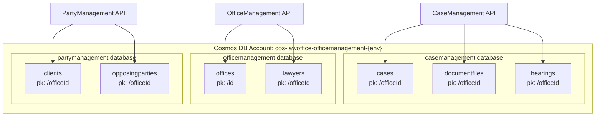
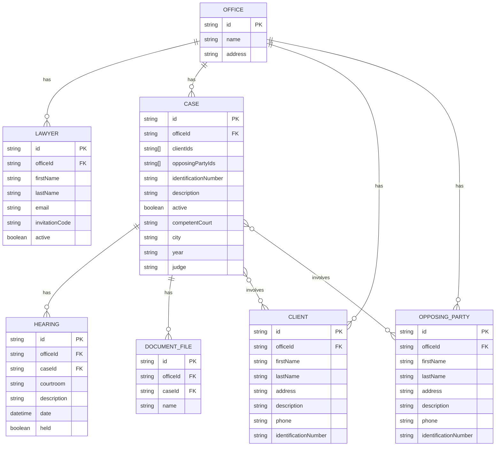
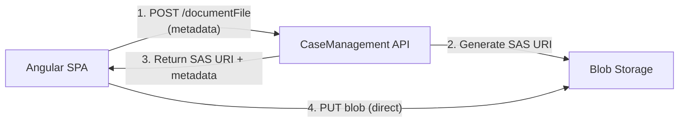

# Data Architecture

## Document Information

| Item               | Detail                                         |
|--------------------|-------------------------------------------------|
| **Project**        | LawOffice - B2C SaaS for Small Law Offices      |
| **Version**        | 1.0                                              |
| **Last Updated**   | 2026-03-10                                       |

---

## 1. Data Architecture Overview

LawOffice uses **Azure Cosmos DB NoSQL** as its primary data store and **Azure Blob Storage** for file storage. The data architecture follows microservice principles - each service owns its database and there is no shared data access across service boundaries.

### 1.1 Data Platform Summary

| Component           | Technology                  | Purpose                              |
|---------------------|-----------------------------|--------------------------------------|
| Document Database   | Cosmos DB NoSQL (Serverless)| Primary data store for all entities   |
| File Storage        | Azure Blob Storage          | Case document file storage            |
| Local Database      | Cosmos DB Emulator          | Local development data store          |
| Local File Storage  | Azurite                     | Local development blob storage        |

---

## 2. Cosmos DB Architecture

### 2.1 Account Configuration

| Setting                    | Value                  | Rationale                             |
|----------------------------|------------------------|---------------------------------------|
| **API**                    | NoSQL (SQL)            | Flexible schema, SQL-like queries     |
| **Capacity Mode**          | Serverless             | Pay-per-request, zero idle cost       |
| **Consistency Level**      | Session                | Read-your-writes within session       |
| **Total Throughput Limit** | 4,000 RU/s             | Cost guard for serverless mode        |
| **Regions**                | Single region           | Cost optimized for demo               |
| **Automatic Failover**     | Enabled                | Platform-managed (single-region)      |
| **Free Tier**              | Disabled               | Not eligible (one per subscription)   |

### 2.2 Database-per-Service Model

Each microservice has its own database, enforcing data ownership boundaries:



---

## 3. Partition Key Strategy

### 3.1 Partition Key Design

| Container       | Partition Key | Rationale                                                    |
|-----------------|---------------|--------------------------------------------------------------|
| cases           | `/officeId`   | Multi-tenancy: all queries scoped to office                  |
| hearings        | `/officeId`   | Hearings queried per-office; cross-case queries (upcoming)   |
| documentfiles   | `/officeId`   | Documents queried per-office; filtered by caseId in query    |
| offices         | `/id`         | Each office is a single document; ID = partition key         |
| lawyers         | `/officeId`   | Lawyers belong to an office; queried per-office              |
| clients         | `/officeId`   | Clients belong to an office; queried per-office              |
| opposingparties | `/officeId`   | Opposing parties belong to an office; queried per-office     |

### 3.2 Partition Key Rationale

The choice of `/officeId` as the dominant partition key serves two purposes:

1. **Multi-tenancy isolation**: Queries within a single partition never cross tenant boundaries
2. **Query efficiency**: All application queries are scoped to a single office, so they always target a single partition (optimal RU consumption)

The `offices` container is the exception - it uses `/id` as the partition key because each office is a standalone document not scoped to another entity.

### 3.3 Partition Key Version

All containers use **Hash V2** partition keys, supporting hierarchical partitioning if needed in the future.

---

## 4. Data Model (Entity Relationship)

### 4.1 Logical Data Model



### 4.2 Cross-Service References

Entities reference entities in other services by ID only (no foreign key enforcement):

| Source Entity | Reference Field        | Target Entity     | Target Service     |
|---------------|------------------------|-------------------|--------------------|
| Case          | `clientIds[]`          | Client            | PartyManagement    |
| Case          | `opposingPartyIds[]`   | OpposingParty     | PartyManagement    |
| Hearing       | `caseId`               | Case              | CaseManagement     |
| DocumentFile  | `caseId`               | Case              | CaseManagement     |

**Note**: Cross-service references are resolved by the frontend via separate API calls. There is no referential integrity enforcement across services - this is an accepted trade-off of the microservice architecture.

---

## 5. Document Storage Design

### 5.1 Cosmos DB Document Structure

All entities extend a base `Entity` class:

```json
{
  "id": "auto-generated GUID",
  "officeId": "tenant-id",
  // ... entity-specific fields
}
```

- The `id` field maps to Cosmos DB's system `id` property (via `[JsonProperty("id")]`)
- IDs are auto-generated GUIDs in entity constructors
- All entities use JSON camelCase serialization (Newtonsoft.Json)

### 5.2 Entity Invariants

Entities enforce business rules through:

1. **Private setters**: All properties have private setters
2. **Factory methods**: `Entity.New()` static methods validate required fields
3. **Setter methods**: `SetX()` methods validate individual field changes
4. **ArgumentException**: Thrown for validation failures (mapped to HTTP 400 by API layer)

---

## 6. Query Patterns

### 6.1 Common Query Patterns

| Pattern              | Cosmos DB Approach                  | RU Impact        |
|----------------------|-------------------------------------|------------------|
| Get by ID + office   | Point read with partition key       | 1 RU (optimal)   |
| Get all for office   | Query with partition key filter     | Low (single partition) |
| Get by sub-filter    | Query with partition + predicate    | Low (single partition) |
| Count (active/total) | Aggregate query with partition key  | Medium           |
| Get last N items     | Query with ORDER BY + TOP           | Medium           |
| Delete               | Point delete with partition key     | ~1 RU            |

### 6.2 Repository Query Examples

```
-- Get all cases for an office
SELECT * FROM c WHERE c.officeId = @officeId

-- Get active case count
SELECT VALUE COUNT(1) FROM c WHERE c.officeId = @officeId AND c.active = true

-- Get last N active cases
SELECT TOP @count * FROM c WHERE c.officeId = @officeId AND c.active = true ORDER BY c._ts DESC

-- Get upcoming hearings
SELECT * FROM c WHERE c.officeId = @officeId AND c.date >= @today ORDER BY c.date ASC
```

### 6.3 Data Access Pattern

All repository methods follow the same pattern:

```
Repository.Method(string officeId, ...) {
    1. Build QueryDefinition with @officeId parameter
    2. GetItemQueryIterator<T> with partition key = officeId
    3. Iterate results → return domain entities
}
```

---

## 7. Blob Storage Architecture

### 7.1 Blob Storage Design

Blob Storage is used exclusively by the **CaseManagement** service for document file storage.



### 7.2 SAS URI Pattern

- **Upload**: API generates a write SAS URI; SPA uploads directly to Blob Storage
- **Download**: API generates a read SAS URI; SPA downloads directly from Blob Storage
- **No proxy**: File data never passes through the API - only metadata is managed

### 7.3 Storage Configuration

| Setting                           | Production                             | Local                                 |
|-----------------------------------|----------------------------------------|---------------------------------------|
| Connection String                 | Azure Storage Account key              | Azurite well-known key                |
| Public SAS Base URI               | Storage Account URL                    | `http://localhost:10000`              |
| CORS Origins                      | SWA hostname only                      | `http://localhost:4200`               |
| Public Blob Access                | Disabled                               | N/A (Azurite)                         |

### 7.4 Blob Service Architecture

```
BlobService
├── BlobContainerClient(containerName)    → Get/create container reference
├── BlobClient(container, blobName)       → Get blob reference
└── BlobClient(containerName, blobName)   → Shorthand

DocumentFileStorageRepository
├── GenerateUploadUri(officeId, caseId, documentId, fileName)  → SAS write URI
└── GenerateDownloadUri(officeId, caseId, documentId, fileName) → SAS read URI
```

---

## 8. Backup & Recovery

### 8.1 Cosmos DB Backup

| Setting              | Value          | Notes                                |
|----------------------|----------------|--------------------------------------|
| Backup Type          | Periodic       | Azure-managed, automatic             |
| Interval             | 240 minutes    | Backup every 4 hours                 |
| Retention            | 8 hours        | 2 backup copies at any time          |
| Storage Redundancy   | Local (LRS)    | Single-region redundancy             |
| Recovery             | Support ticket | Azure support restores to new account|

### 8.2 Blob Storage Protection

| Feature                          | Configuration     |
|----------------------------------|-------------------|
| Soft delete (blobs)              | 7 days            |
| Soft delete (containers)         | 7 days            |
| Permanent delete                 | Disabled          |

### 8.3 Production Recommendations

| Current                        | Recommended for Production                     |
|--------------------------------|------------------------------------------------|
| Periodic backup (4h/8h)       | Continuous backup with 30-day retention         |
| LRS backup storage             | GRS for geo-redundancy                          |
| Support ticket restore         | Self-service point-in-time restore              |
| Single-region deployment       | Multi-region with automatic failover            |

---

## 9. Data Seeding (Local Development)

The **CosmosSeeder** .NET console application initializes the Cosmos Emulator:

### Phase 1: Database Creation
```
casemanagement    → Created
officemanagement  → Created
partymanagement   → Created
```

### Phase 2: Container Creation (with retry)
```
casemanagement/cases           (pk: /officeId) → Created
casemanagement/documentfiles   (pk: /officeId) → Created
casemanagement/hearings        (pk: /officeId) → Created
officemanagement/offices       (pk: /id)       → Created
officemanagement/lawyers       (pk: /officeId) → Created
partymanagement/clients        (pk: /officeId) → Created
partymanagement/opposingparties(pk: /officeId) → Created
```

Container creation includes exponential backoff retry logic to handle partition migration delays in the emulator.

---

## 10. Data Flow Summary

```mermaid
flowchart TB
    subgraph "Write Path"
        W1["SPA POST/PUT"] --> W2["APIM validates JWT"]
        W2 --> W3["Function extracts officeId"]
        W3 --> W4["Application service validates"]
        W4 --> W5["Entity factory/setter validates"]
        W5 --> W6["Repository upserts to Cosmos"]
    end

    subgraph "Read Path"
        R1["SPA GET"] --> R2["APIM validates JWT"]
        R2 --> R3["Function extracts officeId"]
        R3 --> R4["Repository queries by officeId"]
        R4 --> R5["Domain entity → ViewModel mapping"]
        R5 --> R6["JSON response"]
    end

    subgraph "Document Upload Path"
        D1["SPA POST /documentFile"] --> D2["API creates metadata + SAS URI"]
        D2 --> D3["SPA uploads blob via SAS URI"]
        D3 --> D4["Blob stored in Azure Storage"]
    end
```



---

## 11. Consistency Model

| Aspect                    | Approach                                             |
|---------------------------|------------------------------------------------------|
| **Cosmos Consistency**    | Session (read-your-writes for same session)          |
| **Cross-Service**         | Eventual consistency (ID references, frontend joins) |
| **Within Service**        | Strong (single-partition reads after writes)         |
| **Blob ↔ Cosmos**         | Eventually consistent (metadata before blob upload)  |
| **No distributed transactions** | Each service manages its own data independently |
