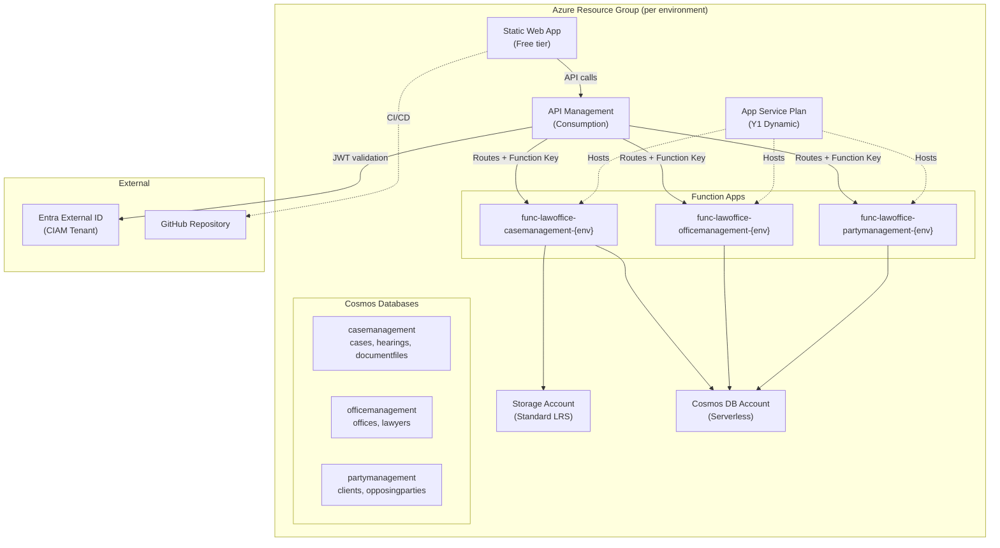
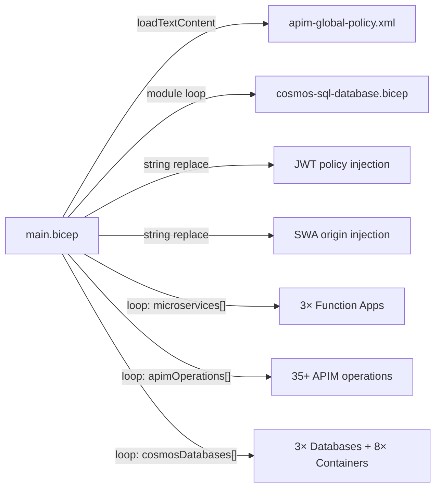
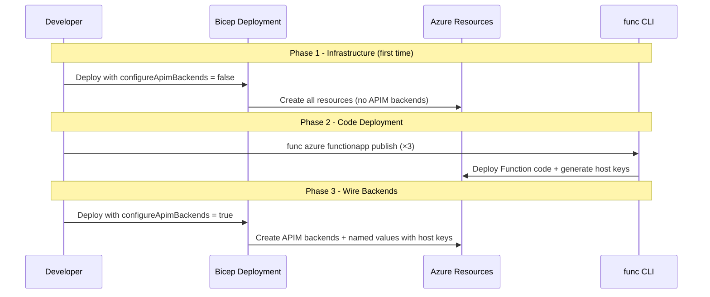
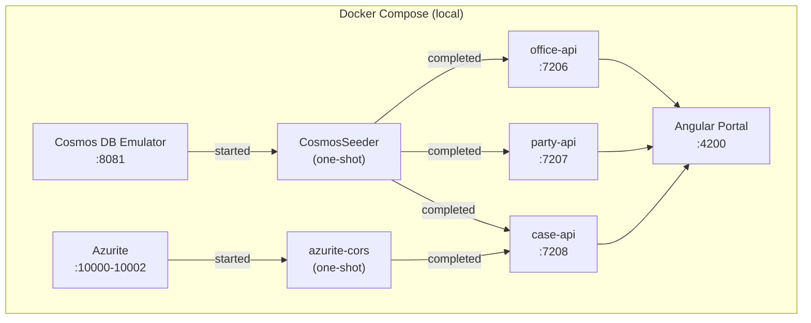

# Infrastructure & Deployment Architecture

## Document Information

| Item               | Detail                                         |
|--------------------|-------------------------------------------------|
| **Project**        | LawOffice - B2C SaaS for Small Law Offices      |
| **Version**        | 1.0                                              |
| **Last Updated**   | 2026-03-10                                       |

---

## 1. Infrastructure Overview

All Azure infrastructure is defined declaratively in **Bicep** and deployed at the **resource group** scope. A single `main.bicep` template provisions every resource required for one environment, parameterized per environment via `.bicepparam` files.

### 1.1 Resource Topology



---

## 2. Azure Resource Inventory

### 2.1 Compute Resources

| Resource                        | Azure Service           | SKU / Tier       | Purpose                              |
|---------------------------------|-------------------------|------------------|--------------------------------------|
| `asp-lawoffice-{env}`           | App Service Plan        | Y1 (Dynamic)     | Shared consumption plan for all Functions |
| `func-lawoffice-casemanagement-{env}` | Function App      | Consumption      | Case, hearing, document APIs          |
| `func-lawoffice-officemanagement-{env}` | Function App    | Consumption      | Office, lawyer, user sign-in/up APIs  |
| `func-lawoffice-partymanagement-{env}` | Function App     | Consumption      | Client, opposing party, count APIs    |
| `swa-lawoffice-portal-{env}`    | Static Web App          | Free             | Angular SPA hosting                   |

### 2.2 Data Resources

| Resource                                    | Azure Service     | Configuration               | Purpose                    |
|---------------------------------------------|-------------------|------------------------------|----------------------------|
| `cos-lawoffice-officemanagement-{env}`      | Cosmos DB Account | Serverless, Session consistency | NoSQL document store     |
| `stlawoffice{env}shared`                    | Storage Account   | Standard LRS, Hot access tier| Function runtime + blob docs |

### 2.3 Networking & Security

| Resource                    | Azure Service          | SKU / Tier    | Purpose                          |
|-----------------------------|------------------------|---------------|----------------------------------|
| `apim-lawoffice-{env}`     | API Management         | Consumption   | API gateway, JWT validation, CORS|
| Entra External ID           | Microsoft Entra (CIAM) | (External)    | B2C identity provider             |

---

## 3. Environment Strategy

### 3.1 Environment Matrix

| Environment | Branch   | Resource Naming           | Entra CIAM | Purpose                     |
|-------------|----------|---------------------------|------------|-----------------------------|
| **dev**     | `master` | `*devshared`              | Shared tenant | Active development, integration testing |
| **test**    | `test`   | `*testshared`             | Shared tenant | QA and acceptance testing    |
| **master**  | `master` | `*master` (dedicated)     | Shared tenant | Production / demo environment |

### 3.2 Parameter File Mapping

| File                    | Environment | Key Overrides                                          |
|-------------------------|-------------|--------------------------------------------------------|
| `main.dev.bicepparam`   | dev         | Shared storage/cosmos names, SWA GitHub integration    |
| `main.test.bicepparam`  | test        | Shared storage/cosmos names, `test` branch for SWA     |
| `main.master.bicepparam`| master      | Dedicated resource names, `master` branch for SWA      |

### 3.3 Shared vs. Dedicated Resources

All three environments share the same **Entra External ID CIAM tenant** (same `jwtOpenIdConfigUrl`, `jwtAudience`, `jwtIssuer`). Dev and Test share a naming pattern (`*shared`), while Master has dedicated resource names.

---

## 4. Infrastructure as Code (Bicep)

### 4.1 Template Structure

```
infra/
├── main.bicep                  # Root template - all resources
├── main.dev.bicepparam         # DEV environment parameters
├── main.test.bicepparam        # TEST environment parameters
├── main.master.bicepparam      # MASTER environment parameters
├── main.json                   # ARM JSON (compiled, for reference)
├── modules/
│   └── cosmos-sql-database.bicep  # Reusable Cosmos DB/container module
├── policies/
│   └── apim-global-policy.xml     # APIM global policy template
└── README.md
```

### 4.2 Key Template Parameters

| Parameter                 | Type   | Description                                                    |
|---------------------------|--------|----------------------------------------------------------------|
| `environmentName`         | string | `dev` / `test` / `prod` / `master` - drives resource naming   |
| `apimPublisherEmail`      | string | Required APIM publisher email                                  |
| `jwtOpenIdConfigUrl`      | string | Entra CIAM OpenID config URL (empty = skip JWT validation)     |
| `jwtAudience`             | string | JWT audience (application client ID)                           |
| `jwtIssuer`               | string | JWT issuer URL                                                 |
| `configureApimBackends`   | bool   | Set `false` on first deploy (before code publish), `true` after |
| `storageAccountName`      | string | Override default naming                                         |
| `cosmosAccountName`       | string | Override default naming                                         |
| `staticWebAppName`        | string | Override default naming                                         |
| `staticWebAppRepositoryUrl` | string | GitHub repo URL for SWA CI/CD integration                   |
| `staticWebAppBranch`      | string | Branch for SWA deployment                                      |

### 4.3 Template Compilation Flow



### 4.4 Data-Driven Resource Creation

The template uses **array-driven loops** for DRY resource creation:

- **`microservices[]`** - Drives Function App, APIM API, backend, and policy creation
- **`apimOperations[]`** - Drives all 35+ APIM operation definitions
- **`cosmosDatabases[]`** - Drives database and container creation via module

Each entry in `microservices[]` controls:
```
{ key, displayName, apiPath, needsBlobStorage }
→ Function App + APIM API + APIM Backend + APIM Named Value + APIM API Policy
```

---

## 5. Deployment Process

### 5.1 Two-Phase Deployment

APIM backends require Function App host keys, which are only available after code is deployed. This necessitates a two-phase approach:



### 5.2 Deployment Commands

```bash
# Phase 1: Infrastructure only (first deploy)
az deployment group create \
  --resource-group rg-lawoffice-{env} \
  --template-file infra/main.bicep \
  --parameters infra/main.{env}.bicepparam \
  --parameters configureApimBackends=false

# Phase 2: Deploy Function code
func azure functionapp publish func-lawoffice-casemanagement-{env}
func azure functionapp publish func-lawoffice-officemanagement-{env}
func azure functionapp publish func-lawoffice-partymanagement-{env}

# Phase 3: Wire APIM backends
az deployment group create \
  --resource-group rg-lawoffice-{env} \
  --template-file infra/main.bicep \
  --parameters infra/main.{env}.bicepparam \
  --parameters configureApimBackends=true
```

### 5.3 Static Web App Deployment

The SWA is configured with **GitHub integration**. Deployment is triggered automatically on push to the configured branch. The SWA build uses the standard Angular build output.

---

## 6. Function App Configuration

### 6.1 Common App Settings (All Functions)

| Setting                       | Source                   | Description                          |
|-------------------------------|--------------------------|--------------------------------------|
| `AzureWebJobsStorage`        | Storage Account key      | Functions runtime storage            |
| `FUNCTIONS_EXTENSION_VERSION` | `~4`                     | Functions runtime version            |
| `FUNCTIONS_WORKER_RUNTIME`    | `dotnet-isolated`        | .NET isolated worker model           |
| `WEBSITE_RUN_FROM_PACKAGE`    | `1`                      | Run from deployment package          |
| `CosmosSettings:ConnectionString` | Cosmos Account       | Cosmos DB connection string          |

### 6.2 CaseManagement-Specific Settings

| Setting                       | Source                   | Description                          |
|-------------------------------|--------------------------|--------------------------------------|
| `BlobSettings:ConnectionString` | Storage Account key    | Blob storage for document files      |

### 6.3 Security Settings (All Functions)

| Setting / Property     | Value          | Purpose                             |
|------------------------|----------------|--------------------------------------|
| `httpsOnly`            | `true`         | Force HTTPS                          |
| `minTlsVersion`        | `1.2`          | Minimum TLS version                  |
| `scmMinTlsVersion`     | `1.2`          | SCM endpoint TLS minimum             |
| `ftpsState`            | `FtpsOnly`     | Disable plain FTP                    |
| FTP publishing          | Disabled       | `basicPublishingCredentialsPolicies` |
| SCM publishing          | Disabled       | `basicPublishingCredentialsPolicies` |

---

## 7. Local Development Environment

### 7.1 Docker Compose Architecture



### 7.2 Service Startup Order

| Order | Service         | Dependency Condition            | Purpose                           |
|-------|-----------------|----------------------------------|-----------------------------------|
| 1     | cosmos          | -                                | Cosmos DB Emulator                |
| 1     | azurite         | -                                | Azure Storage Emulator            |
| 2     | azurite-cors    | azurite: service_started         | Configure blob CORS rules         |
| 2     | cosmos-seeder   | cosmos: service_started          | Create databases + containers     |
| 3     | office-api      | cosmos-seeder: completed         | OfficeManagement Function App     |
| 3     | party-api       | cosmos-seeder: completed         | PartyManagement Function App      |
| 3     | case-api        | cosmos-seeder + azurite-cors: completed | CaseManagement Function App |
| 4     | portal          | all 3 APIs started               | Angular dev server                |

### 7.3 Local Port Mapping

| Service           | Container Port | Host Port | Protocol |
|-------------------|---------------|-----------|----------|
| Cosmos Emulator   | 8081          | 8081      | HTTPS    |
| Azurite Blob      | 10000         | 10000     | HTTP     |
| Azurite Queue     | 10001         | 10001     | HTTP     |
| Azurite Table     | 10002         | 10002     | HTTP     |
| OfficeManagement  | 80            | 7206      | HTTP     |
| PartyManagement   | 80            | 7207      | HTTP     |
| CaseManagement    | 80            | 7208      | HTTP     |
| Angular Portal    | 4200          | 4200      | HTTP     |

### 7.4 Environment Variables (`.env.local`)

| Variable                              | Purpose                                      |
|---------------------------------------|----------------------------------------------|
| `COSMOS_CONNECTION_STRING`            | Cosmos Emulator connection string            |
| `AZURE_WEBJOBS_STORAGE_CONNECTION_STRING` | Azurite connection string              |
| `BLOB_SETTINGS_CONNECTION_STRING`     | Azurite blob connection for CaseManagement   |
| `BLOB_PUBLIC_SAS_BASE_URI`            | Public-facing Azurite URL (`http://localhost:10000`) |
| `BLOB_CORS_ALLOWED_ORIGIN`           | CORS origin for blob access (`http://localhost:4200`) |

### 7.5 CosmosSeeder

A .NET console application that initializes the Cosmos Emulator:

1. **Phase 1**: Creates 3 databases (casemanagement, officemanagement, partymanagement)
2. **Phase 2**: Creates 8 containers with correct partition keys (with retry + exponential backoff for partition migrations)
3. **SSL**: Disables SSL validation for the local emulator's self-signed certificate

---

## 8. APIM Gateway Configuration

### 8.1 API Routing

| APIM API Path | Backend Function App                        | Operations |
|---------------|---------------------------------------------|------------|
| `/case`       | `func-lawoffice-casemanagement-{env}`       | 18         |
| `/office`     | `func-lawoffice-officemanagement-{env}`     | 6          |
| `/party`      | `func-lawoffice-partymanagement-{env}`      | 9          |

### 8.2 Backend Authentication

APIM authenticates to Function Apps using **Function host keys** stored as APIM named values:

```
APIM Request → x-functions-key: {{func-lawoffice-{service}-{env}-key}} → Function App
```

### 8.3 Global Policy Pipeline

```
Inbound:
  1. CORS (SWA origin + localhost:4200)
  2. JWT Validation (optional, Entra External ID)
     → Extract extension_OfficeId → X-Office-Id header
  3. Set Backend Service (per-API policy)

Backend:
  Forward request to Function App

Outbound:
  (pass-through)
```

---

## 9. Tagging Strategy

All resources are tagged with:

| Tag Key      | Example Value | Purpose                          |
|--------------|---------------|----------------------------------|
| `project`    | `LawOffice`   | Project identification           |
| `env`        | `dev`         | Environment identification       |
| `managedBy`  | `bicep`       | IaC tool identification          |

---

## 10. Outputs

The Bicep template provides the following outputs for downstream use:

| Output                         | Type     | Description                              |
|--------------------------------|----------|------------------------------------------|
| `storageAccountId`             | string   | Storage Account resource ID              |
| `cosmosAccountEndpoint`        | string   | Cosmos DB account endpoint URI           |
| `functionAppNames`             | string[] | Names of all 3 Function Apps             |
| `functionAppHostNames`         | string[] | Default hostnames of all Function Apps   |
| `apimGatewayUrl`               | string   | APIM gateway URL                         |
| `staticWebAppDefaultHostname`  | string   | SWA default hostname                     |
