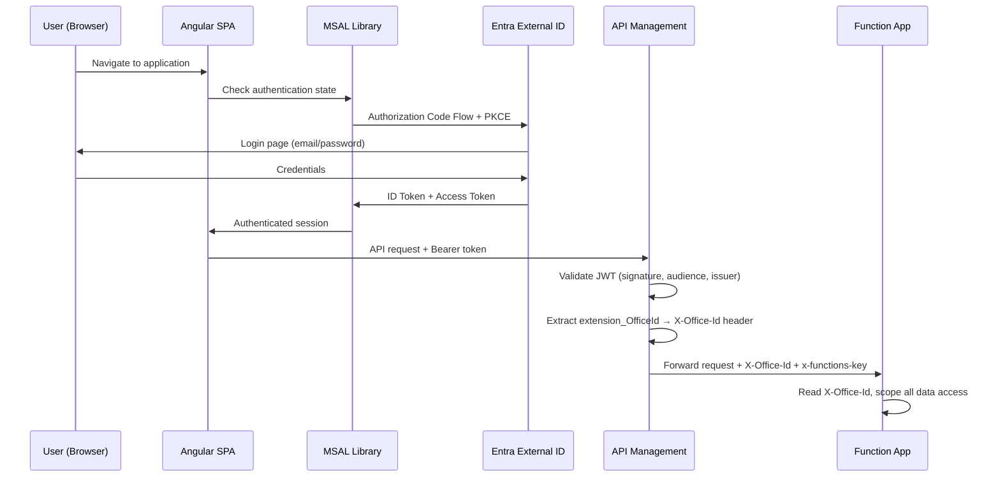
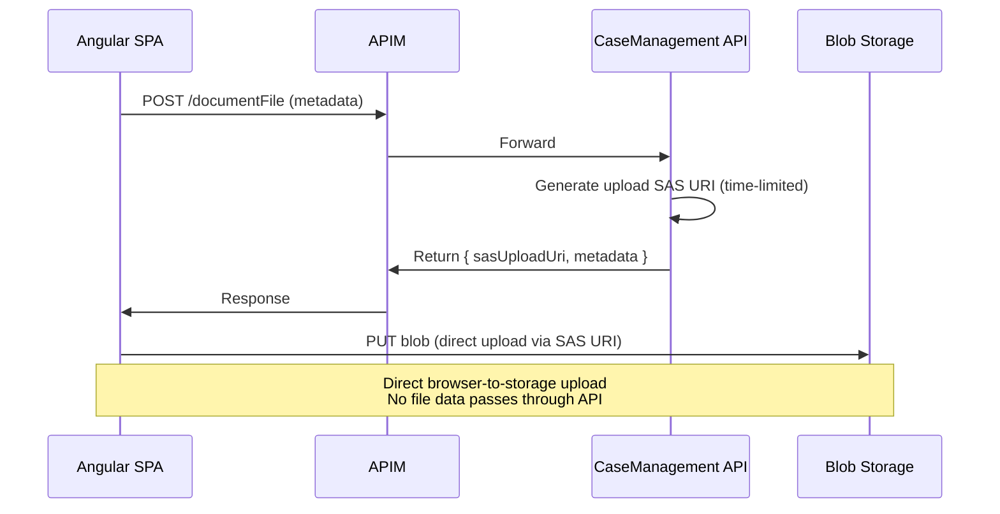

# Security Architecture

## Document Information

| Item               | Detail                                         |
|--------------------|-------------------------------------------------|
| **Project**        | LawOffice — B2C SaaS for Small Law Offices      |
| **Version**        | 1.0                                              |
| **Last Updated**   | 2026-03-10                                       |

---

## 1. Security Overview

LawOffice implements a defense-in-depth security model with identity-centric access control. Security is enforced at multiple layers: identity provider, API gateway, application services, and data tier. The multi-tenant architecture relies on claim-based tenant isolation, ensuring each law office's data is strictly segregated.

---

## 2. Identity & Authentication

### 2.1 Identity Provider

| Property             | Value                                                          |
|----------------------|----------------------------------------------------------------|
| **Provider**         | Microsoft Entra External ID (CIAM)                             |
| **Tenant**           | `lawofficecustomers.ciamlogin.com`                            |
| **Protocol**         | OpenID Connect / OAuth 2.0                                     |
| **Application ID**   | `a9a5990c-f11e-49df-a582-a2c1416456cf`                       |
| **API Scope**        | `api://a9a5990c-f11e-49df-a582-a2c1416456cf/access_as_user`  |
| **Token Format**     | JWT (JSON Web Token)                                           |

### 2.2 Authentication Flow



### 2.3 Token Claims

The JWT access token contains the following application-relevant claims:

| Claim                  | Type   | Purpose                                       |
|------------------------|--------|-----------------------------------------------|
| `sub`                  | string | Unique user identifier                        |
| `name`                 | string | User display name                             |
| `preferred_username`   | string | User email / login name                       |
| `extension_OfficeId`   | string | **Custom claim** — the tenant (office) identifier |
| `aud`                  | string | Target audience (application client ID)       |
| `iss`                  | string | Token issuer URL                              |

### 2.4 MSAL Configuration (Frontend)

| Setting                    | Value                                                              |
|----------------------------|--------------------------------------------------------------------|
| **Authority**              | `https://lawofficecustomers.ciamlogin.com`                        |
| **Client ID**              | `a9a5990c-f11e-49df-a582-a2c1416456cf`                           |
| **Redirect URI**           | Dynamically configured via `config.js`                            |
| **Interaction Type**       | Redirect                                                           |
| **Token Scopes**           | `api://...access_as_user`                                         |
| **MSAL Interceptor**       | Auto-attaches Bearer tokens to configured API endpoints           |
| **MSAL Guard**             | Protects routes requiring authentication (e.g., `/office`)        |

---

## 3. Authorization

### 3.1 Authorization Model

LawOffice uses a **claim-based, tenant-scoped** authorization model:

```
┌─────────────────────────────────────────────────────────┐
│                    APIM Gateway                          │
│  ┌───────────────────────────────────────────────────┐  │
│  │ JWT Validation                                     │  │
│  │ ✓ Valid signature (via OpenID config)              │  │
│  │ ✓ Correct audience (application client ID)        │  │
│  │ ✓ Correct issuer (CIAM tenant)                    │  │
│  │ ✓ Required claim: extension_OfficeId exists       │  │
│  └───────────────────────────────────────────────────┘  │
│  ┌───────────────────────────────────────────────────┐  │
│  │ Claim Extraction                                   │  │
│  │ extension_OfficeId → X-Office-Id HTTP header      │  │
│  └───────────────────────────────────────────────────┘  │
└─────────────────────────────────────────────────────────┘
                          │
                          ▼
┌─────────────────────────────────────────────────────────┐
│                   Function App                           │
│  ┌───────────────────────────────────────────────────┐  │
│  │ HttpRequestExtensions.GetOfficeId()                │  │
│  │ ✓ Validates X-Office-Id header present            │  │
│  │ ✓ Returns 400 Bad Request if missing              │  │
│  └───────────────────────────────────────────────────┘  │
│  ┌───────────────────────────────────────────────────┐  │
│  │ Data Access Layer                                  │  │
│  │ ✓ All queries scoped by officeId                  │  │
│  │ ✓ officeId = Cosmos DB partition key              │  │
│  └───────────────────────────────────────────────────┘  │
└─────────────────────────────────────────────────────────┘
```

### 3.2 Authorization Layers

| Layer          | Mechanism                               | Enforcement              |
|----------------|-----------------------------------------|--------------------------|
| **Gateway**    | JWT validation (signature + claims)     | APIM global policy       |
| **API**        | `X-Office-Id` header presence check     | HttpRequestExtensions    |
| **Data**       | All queries filter by `officeId`        | Repository implementations |
| **Cosmos DB**  | Partition key = `officeId`              | Physical data isolation  |

### 3.3 No Role-Based Access Control (RBAC)

The current design does not implement fine-grained RBAC within a tenant. All authenticated users with a valid `extension_OfficeId` claim have full access to their office's data. This is intentional for the small-office target market where all staff members need full access.

---

## 4. Tenant Isolation

### 4.1 Isolation Strategy

| Aspect            | Approach                           | Isolation Level          |
|-------------------|------------------------------------|--------------------------|
| **Compute**       | Shared Function Apps (all tenants) | Logical (query-scoped)   |
| **Database**      | Shared containers, partition key   | Logical (partition-scoped) |
| **Storage**       | Shared storage account             | Logical (path-scoped)    |
| **Network**       | Shared APIM                        | Logical (claim-scoped)   |
| **Identity**      | Shared CIAM tenant                 | Logical (claim-scoped)   |

### 4.2 Isolation Guarantees

1. **Every API call** requires a valid JWT with `extension_OfficeId`
2. **APIM rejects** requests with missing or invalid tokens (HTTP 401)
3. **Function Apps reject** requests missing the `X-Office-Id` header (HTTP 400)
4. **Every database query** includes `officeId` as a filter parameter
5. **Cosmos DB partition keys** ensure cross-tenant queries are physically impossible within a single-partition read

### 4.3 Cross-Tenant Risk Mitigation

| Risk                            | Mitigation                                                   |
|---------------------------------|--------------------------------------------------------------|
| Token tampering                 | JWT signature validation against Entra JWKS                  |
| Missing tenant claim            | APIM requires `extension_OfficeId` as a mandatory claim      |
| Header spoofing                 | APIM overwrites `X-Office-Id` from JWT (exists-action=override) |
| Query scope bypass              | Repository layer always includes officeId in query predicates |
| Partition-level isolation       | Cosmos partition key ensures no cross-partition data leakage  |

---

## 5. Transport Security

### 5.1 TLS Configuration

| Component          | Minimum TLS | HTTPS Only | Notes                               |
|--------------------|------------|------------|--------------------------------------|
| Function Apps      | TLS 1.2    | Yes        | `httpsOnly: true`, `minTlsVersion: 1.2` |
| Function SCM       | TLS 1.2    | Yes        | `scmMinTlsVersion: 1.2`             |
| APIM               | TLS 1.2    | Yes        | TLS 1.0/1.1/SSL 3.0 explicitly disabled |
| Storage Account    | TLS 1.2    | Yes        | `supportsHttpsTrafficOnly: true`     |
| Cosmos DB          | TLS 1.2    | Yes        | `minimalTlsVersion: Tls12`          |
| Static Web App     | TLS 1.2    | Yes        | Platform-managed certificate         |

### 5.2 Disabled Legacy Protocols (APIM)

```
TLS 1.0 (client + backend): Disabled
TLS 1.1 (client + backend): Disabled
SSL 3.0 (backend): Disabled
```

---

## 6. Access Control — Infrastructure

### 6.1 Publishing Credentials

| Setting                              | Value    | Purpose                              |
|--------------------------------------|----------|--------------------------------------|
| FTP basic publishing credentials     | Disabled | Prevent FTP-based code deployment    |
| SCM basic publishing credentials     | Disabled | Prevent SCM-based code deployment    |
| FTP State                            | FtpsOnly | If needed, enforce FTPS only         |

### 6.2 Storage Account Security

| Setting                    | Value    | Purpose                              |
|----------------------------|----------|--------------------------------------|
| `allowBlobPublicAccess`    | `false`  | No anonymous blob access             |
| `allowSharedKeyAccess`     | `true`   | Required for Function runtime        |
| Network ACL default action | `Allow`  | Public access (Consumption tier limitation) |
| Network ACL bypass         | `AzureServices` | Allow Azure service access    |

### 6.3 APIM Security Configuration

| Setting                              | Value    | Purpose                              |
|--------------------------------------|----------|--------------------------------------|
| System-assigned managed identity     | Enabled  | Future Azure resource access         |
| Legacy portal                        | Disabled | Only developer portal available      |
| Public network access                | Enabled  | Required for Consumption tier        |
| Subscription required (APIs)         | `false`  | JWT validation handles auth instead  |

---

## 7. Data Protection

### 7.1 Encryption at Rest

| Service          | Encryption            | Key Management                      |
|------------------|-----------------------|--------------------------------------|
| Cosmos DB        | AES-256 (platform)    | Microsoft-managed keys               |
| Blob Storage     | AES-256 (platform)    | Microsoft-managed keys               |
| Function Apps    | Platform encryption   | Microsoft-managed keys               |

### 7.2 Encryption in Transit

All communication is encrypted via TLS 1.2+ (see Section 5).

### 7.3 Blob Storage Access (Documents)

Document files are accessed via **Shared Access Signature (SAS) URIs**:



- **Upload**: SPA uploads directly to Blob Storage via SAS URI
- **Download**: SPA downloads directly from Blob Storage via SAS URI
- **No anonymous access**: Blob public access is disabled; SAS tokens are required
- **CORS**: Blob service has CORS configured for the SWA origin only

### 7.4 Cosmos DB Backup

| Setting              | Value          | Notes                                |
|----------------------|----------------|--------------------------------------|
| Backup type          | Periodic       | Automatic, platform-managed          |
| Backup interval      | 240 minutes    | Every 4 hours                        |
| Retention            | 8 hours        | 2 backup copies retained             |
| Storage redundancy   | Local          | LRS (cost-optimized for demo)        |

---

## 8. CORS Policy

### 8.1 APIM CORS Configuration

| Setting             | Value                                          |
|---------------------|------------------------------------------------|
| Allowed origins     | SWA hostname (dynamic), `http://localhost:4200` |
| Allowed methods     | GET, POST, PUT, PATCH, DELETE                   |
| Allowed headers     | `*` (all)                                       |
| Exposed headers     | `*` (all)                                       |
| Allow credentials   | `true`                                          |
| Preflight max age   | 300 seconds                                     |

### 8.2 Blob Storage CORS Configuration

| Setting             | Value                                          |
|---------------------|------------------------------------------------|
| Allowed origins     | SWA hostname only                               |
| Allowed methods     | GET, PUT, OPTIONS                               |
| Allowed headers     | `x-ms-blob-type`, `content-type`               |
| Exposed headers     | `x-ms-request-id`, `x-ms-version`              |
| Max age             | 3600 seconds                                    |

---

## 9. Local Development Security Considerations

| Aspect                     | Production                        | Local Development                          |
|----------------------------|-----------------------------------|--------------------------------------------|
| JWT Validation             | APIM validates JWT                | `ApimSimulatorInterceptor` injects X-Office-Id from token |
| TLS                        | TLS 1.2 everywhere               | HTTP (plain) for local services            |
| Cosmos SSL                 | Certificate validated             | SSL validation disabled for emulator       |
| Blob Access                | SAS URI via HTTPS                 | SAS URI via HTTP (localhost)               |
| APIM Gateway               | Full APIM gateway                 | Direct Function App access (no APIM)       |
| `X-Office-Id` source       | Extracted by APIM from JWT        | Injected by Angular interceptor from JWT   |

---

## 10. Security Threat Model Summary

| Threat                                | STRIDE Category | Mitigation                                          |
|---------------------------------------|-----------------|-----------------------------------------------------|
| Unauthorized API access               | Spoofing        | JWT validation at APIM                              |
| Cross-tenant data access              | Information Disclosure | Partition key isolation + query scoping      |
| Token theft                           | Spoofing        | PKCE flow, short-lived tokens, HTTPS only           |
| Man-in-the-middle                     | Tampering       | TLS 1.2+ on all endpoints                           |
| Header injection (X-Office-Id)        | Tampering       | APIM overwrites header (`exists-action=override`)   |
| Unauthorized blob access              | Information Disclosure | SAS tokens, no public blob access           |
| FTP/SCM credential compromise         | Elevation of Privilege | Publishing credentials disabled            |
| Data exposure via backup              | Information Disclosure | Encrypted backups, limited retention        |
| DDoS                                  | Denial of Service | Consumption tier auto-scale + Azure platform protection |

---

## 11. Compliance Considerations

While this is a portfolio/demo project, the architecture follows patterns suitable for:

| Standard      | Relevant Controls                                              |
|---------------|----------------------------------------------------------------|
| **GDPR**      | Tenant data isolation, encryption at rest/transit              |
| **SOC 2**     | Access controls, audit logging (via Azure platform)            |
| **ISO 27001** | Network security, key management, access control               |

### Production Readiness Gaps

| Gap                                    | Recommendation for Production                       |
|----------------------------------------|-----------------------------------------------------|
| No Azure Key Vault integration         | Store connection strings and keys in Key Vault       |
| No VNet integration                    | Deploy Functions in VNet; use private endpoints       |
| No WAF                                 | Add Azure Front Door or Application Gateway with WAF |
| Storage shared key access enabled      | Transition to managed identity-based access           |
| No audit logging pipeline              | Enable diagnostic settings → Log Analytics            |
| No rate limiting                       | Add APIM rate-limit policies                          |
| Broad CORS allowed headers             | Restrict to specific required headers                 |
