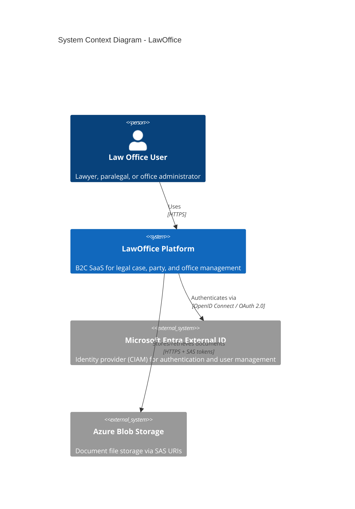
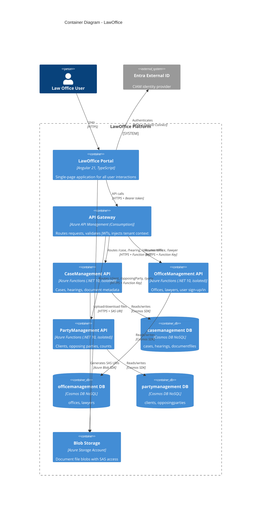

# Solution Architecture Overview

## Document Information

| Item               | Detail                                         |
|--------------------|-------------------------------------------------|
| **Project**        | LawOffice - B2C SaaS for Small Law Offices      |
| **Version**        | 1.0                                              |
| **Classification** | Internal / Portfolio                             |
| **Last Updated**   | 2026-03-10                                       |

---

## 1. Executive Summary

LawOffice is a multi-tenant, business-to-consumer (B2C) Software-as-a-Service platform that enables small law offices to manage their cases, parties, hearings, documents, and office staff through a modern web application. The platform is built on Microsoft Azure using a microservices architecture with a serverless-first approach, optimizing for minimal operational overhead and cost efficiency.

### 1.1 Key Business Capabilities

| Capability            | Description                                                        |
|-----------------------|--------------------------------------------------------------------|
| **Case Management**   | Create, track and close legal cases with status and metadata       |
| **Hearing Scheduling**| Schedule court hearings linked to cases with courtroom details     |
| **Document Management**| Upload, download, and organize case-related documents via SAS URIs|
| **Party Management**  | Manage clients and opposing parties with contact information       |
| **Office Administration** | Manage office details and lawyer profiles with invitation codes|

---

## 2. Architecture Principles

| Principle                       | Rationale                                                                    |
|---------------------------------|------------------------------------------------------------------------------|
| **Serverless-First**            | Minimize operational overhead; pay only for actual usage                      |
| **Microservice Boundaries**     | Domain-driven decomposition; each service owns its data and lifecycle         |
| **Infrastructure as Code**      | All Azure resources defined in Bicep; repeatable, auditable deployments      |
| **Security by Default**         | TLS 1.2+, JWT validation at gateway, tenant isolation via partition keys     |
| **Cost Optimization**           | Consumption-tier services across the board for portfolio/low-traffic workloads|
| **Local Development Parity**    | Fully containerized local environment mirrors cloud architecture             |

---

## 3. System Context (C4 Level 1)



---

## 4. Container Diagram (C4 Level 2)



---

## 5. Component Architecture

### 5.1 Microservice Internal Layering

Each microservice follows a consistent **Clean Architecture** (layered) pattern:

```
┌─────────────────────────────────────┐
│            API Layer                │  Azure Functions HTTP triggers
│  (Functions/, Extensions/)          │  Request parsing, validation, routing
├─────────────────────────────────────┤
│         Application Layer           │  Business logic orchestration
│  (Services/, Extensions/)           │  DTO mapping, cross-cutting concerns
├─────────────────────────────────────┤
│           Domain Layer              │  Pure domain model
│  (Entities/, Interfaces/,           │  Factory methods, invariant validation
│   ViewModels/)                      │  No infrastructure dependencies
├─────────────────────────────────────┤
│       Infrastructure Layer          │  Data access implementation
│  (Repositories/, Data/,             │  Cosmos DB SDK, Blob SDK
│   Extensions/)                      │  DI registration
└─────────────────────────────────────┘
```

### 5.2 Dependency Direction

```
API → Application → Domain ← Infrastructure
```

- **Domain** layer has zero external dependencies (pure C# classes).
- **Infrastructure** depends on Domain (implements repository interfaces).
- **Application** depends on Domain (uses entities and repository contracts).
- **API** depends on Application (calls service interfaces).
- DI wiring is done via `ServiceCollectionExtensions` in each layer.

### 5.3 Microservice Decomposition

| Service              | Bounded Context      | Entities                          | Database             |
|----------------------|----------------------|-----------------------------------|----------------------|
| CaseManagement API   | Legal Case Lifecycle | Case, Hearing, DocumentFile       | casemanagement       |
| OfficeManagement API | Office & Staff       | Office, Lawyer                    | officemanagement     |
| PartyManagement API  | Legal Parties        | Party (Client, OpposingParty)     | partymanagement      |

---

## 6. Multi-Tenancy Model

LawOffice implements **partition-based tenant isolation** as its multi-tenancy strategy:

```
┌──────────────────────────────────────────┐
│          Shared Infrastructure           │
│  (Cosmos Account, Storage, APIM, SWA)    │
├──────────────────────────────────────────┤
│    Tenant A (officeId = "abc-123")       │
│    ┌─────────┐ ┌──────────┐ ┌─────────┐ │
│    │ cases   │ │ hearings │ │ clients │ │
│    │ pk=abc  │ │ pk=abc   │ │ pk=abc  │ │
│    └─────────┘ └──────────┘ └─────────┘ │
├──────────────────────────────────────────┤
│    Tenant B (officeId = "def-456")       │
│    ┌─────────┐ ┌──────────┐ ┌─────────┐ │
│    │ cases   │ │ hearings │ │ clients │ │
│    │ pk=def  │ │ pk=def   │ │ pk=def  │ │
│    └─────────┘ └──────────┘ └─────────┘ │
└──────────────────────────────────────────┘
```

### Tenant Isolation Flow

1. **User authenticates** via Entra External ID → receives JWT with `extension_OfficeId` claim
2. **APIM validates JWT** and extracts `extension_OfficeId` into `X-Office-Id` HTTP header
3. **Function API reads** `X-Office-Id` header via `HttpRequestExtensions.GetOfficeId()`
4. **All data queries** filter by `officeId` which is the Cosmos DB partition key
5. **Result**: data from different tenants is physically co-located but logically isolated

---

## 7. Technology Stack

| Layer              | Technology                               | Version    |
|--------------------|------------------------------------------|------------|
| Frontend SPA       | Angular                                  | 21.1       |
| UI Components      | Angular Material                         | 21.1       |
| Authentication SDK | MSAL Angular / MSAL Browser              | 5.1 / 5.3  |
| Frontend Testing   | Vitest                                   | 4.0        |
| Backend Runtime    | .NET (isolated worker)                   | 10.0       |
| Backend Host       | Azure Functions                          | v4         |
| Serialization      | Newtonsoft.Json                          | 13.x       |
| Backend Testing    | xUnit + NSubstitute + Shouldly          | 2.9 / 5.3 / 4.3 |
| Database           | Azure Cosmos DB NoSQL (Serverless)       | -          |
| File Storage       | Azure Blob Storage                       | -          |
| API Gateway        | Azure API Management (Consumption)       | -          |
| Static Hosting     | Azure Static Web Apps (Free)             | -          |
| Identity Provider  | Microsoft Entra External ID (CIAM)       | -          |
| IaC                | Bicep                                    | -          |
| Local Development  | Docker Compose                           | -          |
| Source Control     | Git / GitHub                             | -          |

---

## 8. Communication Patterns

### 8.1 Synchronous (Request-Response)

All communication in the current architecture is synchronous HTTP/HTTPS:

```
Browser ──HTTPS──▶ APIM ──HTTPS──▶ Function App ──SDK──▶ Cosmos DB
                                        │
                                        └──SDK──▶ Blob Storage (SAS generation only)
```

- **Browser → APIM**: Bearer token in Authorization header
- **APIM → Function App**: Function host key in `x-functions-key` header + tenant ID in `X-Office-Id` header
- **Browser → Blob Storage**: Direct upload/download via time-limited SAS URIs (bypasses APIM)

### 8.2 Cross-Service Data References

Services reference entities from other services by ID only (eventual consistency acceptable):

| Source Service   | References            | Target Service     |
|------------------|-----------------------|--------------------|
| CaseManagement   | `clientIds[]`         | PartyManagement    |
| CaseManagement   | `opposingPartyIds[]`  | PartyManagement    |
| Frontend         | Aggregates case + party data | Both services |

No direct service-to-service calls exist. The frontend orchestrates cross-service joins.

---

## 9. Key Architectural Characteristics

| Characteristic    | Rating | Justification                                                                |
|-------------------|--------|------------------------------------------------------------------------------|
| **Scalability**   | Medium | Serverless compute auto-scales; Cosmos DB serverless handles variable load   |
| **Availability**  | Medium | Consumption tier cold starts; single-region deployment                        |
| **Security**      | High   | JWT validation, TLS 1.2+, partition-based isolation, SAS-scoped blob access  |
| **Cost Efficiency** | High | All consumption/free tiers; near-zero cost at idle                          |
| **Maintainability**| High  | Clean layered architecture, IaC, consistent patterns across microservices    |
| **Testability**   | High   | All layers independently testable; mock-friendly interfaces                  |
| **Deployability** | High   | Independent service deployment; parameterized multi-environment IaC          |

---

## 10. Related Documents

| Document                                                                       | Scope                                |
|--------------------------------------------------------------------------------|--------------------------------------|
| [Infrastructure & Deployment](INFRASTRUCTURE_AND_DEPLOYMENT.md)                | Azure resources, IaC, CI/CD, environments |
| [Security Architecture](SECURITY_ARCHITECTURE.md)                              | Identity, AuthN/AuthZ, data protection    |
| [API Design](API_DESIGN.md)                                                    | API catalog, gateway patterns, contracts  |
| [Data Architecture](DATA_ARCHITECTURE.md)                                      | Cosmos DB, partitioning, blob storage     |
| [Architecture Decision Records](ARCHITECTURE_DECISION_RECORDS.md)              | Key design decisions and rationale        |
| [Operational Runbook](OPERATIONAL_RUNBOOK.md)                                  | Monitoring, incident response, operations |
| [Cost Analysis & Optimization](COST_ANALYSIS.md)                               | Azure cost model, scaling path            |
